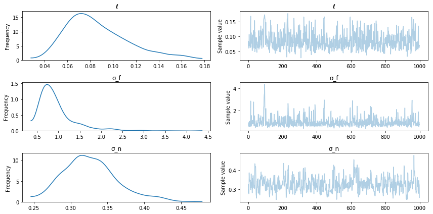
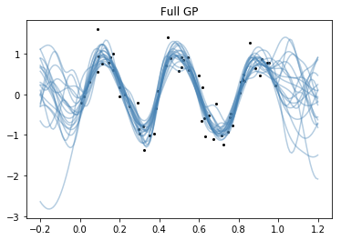

Title: FITC and VFE
Date: 6/28/2017
Category: posts
Tags: gp, gsoc, gp-approximations
Two general Gaussian Process approximation methods are FITC (fully independent training conditional), and VFE (variational free energy).  

<!-- PELICAN_END_SUMMARY -->

These GP approximations don't form the full covariance matrix over all $n$ training inputs.  Instead they rely on $m < n$ *inducing points*, which are "strategically" placed throughout the domain.  Both of these approximations reduce the $\mathcal{O(n^3)}$ complexity of GPs down to $\mathcal{O(nm^2)}$ --- a significant speed up.  The memory requirements scale down a bit too, but not as much.  They are commonly referred to as *sparse* approximations, in the sense of being data sparse.  The downside of sparse approximations is that they reduce the expressiveness of the GP.  Reducing the dimension of the covariance matrix effectively reduces the number of covariance matrix eigenvectors that can be used to fit the data.  

## FITC 

The FITC approximation is generally considered the "gold-standard" GP approximation.  It was originally called sparse Gaussian Processes using pseudo-inputs (SGPP) [Snelson+Ghahramani, 2006].  It was reformulated by [Quinonero-Candela+Rasmussen, 2006].  Therein, they showed that the FITC approximation can be thought of as not just an approximation, but also as sort of an odd Gaussian Process prior in its own right,

$$
f \sim \mathcal{GP}_{FITC}(0\,, Q_{ff} - \mathrm{diag}[K_{ff} - Q_{ff}]) \,.
$$

The matrix $Q_{ff}$ is the Nystrom approximation to the full covariance matrix, $K_{ff}$.

$$
Q_{ff} = K_{fu}K_{uu}^{-1}K_{uf}
$$

## VFE

The VFE approximation is a bit newer [Titsias 2009], and is derived from a variational approach.  The marginal likelihood is derived by trying to minimize the Kullback-Leibler divergence between the sparse GP and the full GP.  It uses a variational formulation to obtain a lower bound on the marginal likelihood.  

## Comparison

Currently, both of these methods can only be applied to Gaussian Process models with IID Gaussian noise:

$$
\begin{aligned}
y \sim N(f\,, \sigma^2 \mathbf{I})& \\
f \sim \mathcal{GP}(\mu(x)\,, k(x, x'))&\\
\end{aligned}
$$

I'm positive VFE can only be used in this scenario.  I'm not completely convinced that FITC cannot be used with Gaussian noise that has correlations.   Neither method is intended to be used with non-Gaussian likelihoods.  Interestingly, both methods have a similar form for the marginal likelihood:

$$
-\mathcal{L} = \frac{n}{2}\log(2\pi) + \frac{1}{2} \log|Q_{ff} + G| +
               \frac{1}{2}y^T(Q_{ff} + G)^{-1}y + 
               \frac{1}{2\sigma_n^2}tr(T)
$$
where $G_{FITC} = \mathrm{diag}[K_{ff} - Q_{ff}] + \sigma^2_n I$, and $G_{VFE} = \sigma^2_n I$.  Also, 
$T_{VFE} = K_{ff} - Q_{ff}$, while $T_{FITC} = 0$.  Because of this similarity, I implemented 
both methods in PyMC3 with a flag to use either approximation.  I plan on Latex'ing this up and posting it soon, it took some time to work out! 

# Examples

## 1 Dimensional Data, 50 data points


```python
import pymc3 as pm

import theano
import theano.tensor as tt
import numpy as np

import matplotlib.pyplot as plt
%matplotlib inline
np.random.seed(10)
```


```python
nx, nu = 60, 7
x = np.random.rand(nx)
xu = np.random.rand(nu)
y = np.sin(2 * np.pi * x * 2.5) + 0.3 * np.random.randn(nx)
    
plt.plot(x, y, 'ko', ms=2);
plt.plot(xu, 0.0*np.ones(len(xu)), 'rx', ms=10)
x = x[:,None]; xu = xu[:,None]
xs = np.linspace(-0.1, 1.1, 100)
```


## Full GP 


```python
with pm.Model() as model:
    ℓ = pm.Gamma("ℓ", alpha=1.5, beta=0.5)
    σ_f = pm.HalfCauchy("σ_f", beta=5)
    σ_n = pm.HalfCauchy("σ_n", beta=5)
    cov = tt.square(σ_f) * pm.gp.cov.ExpQuad(1, ℓ)
    gp = pm.gp.GP("gp", x, cov, sigma=σ_n, observed=y)
    trace = pm.sample(1000)
```

    Auto-assigning NUTS sampler...
    Initializing NUTS using ADVI...
    Average Loss = 74.909:   7%|▋         | 13198/200000 [00:29<06:01, 516.70it/s]
    Convergence archived at 13200
    Interrupted at 13,200 [6%]: Average Loss = 94.177
    100%|██████████| 1500/1500 [01:00<00:00, 32.17it/s]


```python
pm.traceplot(trace);
```





### Posterior sampling


```python
Xs = np.linspace(-0.2, 1.2, 150)[:, None]
with model:
    samples = pm.gp.sample_gp(trace, gp, Xs, n_samples=20, obs_noise=False)
    
plt.plot(x.flatten(), y, 'ko', ms=2);
plt.plot(Xs.flatten(), samples.T, "steelblue", alpha=0.4);
plt.title("Full GP");
```

    100%|██████████| 20/20 [00:13<00:00,  1.57it/s]





## FITC

There are 3 arguments to GP that involve the FITC or VFE approximation, `inducing_points`, `n_inducing` and `approx`.  By default, all of these arguments are `None` and the full GP is used.  At least one of `n_inducing` and `inducing_points` must be provided.  If `approx` is not specified, `FITC` is used by default. 

If `n_inducing` is provided, the inducing point locations are chosen by running K-means on the input matrix, `X`.


```python
with pm.Model() as model:
    ℓ = pm.Gamma("ℓ", alpha=1.5, beta=0.5)
    σ_f = pm.HalfCauchy("σ_f", beta=5)
    σ_n = pm.HalfCauchy("σ_n", beta=5)
    cov = tt.square(σ_f) * pm.gp.cov.Matern52(1, ℓ)
    gp = pm.gp.GP("gp", x, cov, sigma=σ_n, inducing_points=xu, observed=y)
    trace = pm.sample(1000)
```

    Using FITC approximation for gp
    Auto-assigning NUTS sampler...
    Initializing NUTS using ADVI...
    Average Loss = 75.271:   6%|▌         | 11650/200000 [00:17<04:35, 682.78it/s]
    Convergence archived at 11700
    Interrupted at 11,700 [5%]: Average Loss = 96.56
    100%|██████████| 1500/1500 [00:58<00:00, 25.59it/s]


```python
pm.traceplot(trace);
```


### Posterior sampling


```python
Xs = np.linspace(-0.2, 1.2, 150)[:, None]
with model:
    samples = pm.gp.sample_gp(trace, gp, Xs, n_samples=20, obs_noise=False)
    
plt.plot(x.flatten(), y, 'ko', ms=2);
plt.plot(Xs.flatten(), samples.T, "steelblue", alpha=0.4);
plt.title("FITC");
plt.plot(xu.flatten(), -2*np.ones(len(xu)), "rx");
```

    100%|██████████| 20/20 [00:26<00:00,  1.32s/it]


If you look at the GP predictive samples where there aren't inducing points, the approximations are noticeably worse than the full GP.  Here the predictions go towards the FITC prior.  

## VFE with k-means

Instead of randomly setting the inducing points, we choose them with K-means.


```python
with pm.Model() as model:
    ℓ = pm.Gamma("ℓ", alpha=1.5, beta=0.5)
    σ_f = pm.HalfCauchy("σ_f", beta=5)
    σ_n = pm.HalfCauchy("σ_n", beta=5)
    cov = tt.square(σ_f) * pm.gp.cov.Matern52(1, ℓ)
    gp = pm.gp.GP("gp", x, cov, sigma=σ_n, n_inducing=nu, approx="vfe", observed=y)
    trace = pm.sample(1000)
```

    Initializing inducing point locations with K-Means...
    Auto-assigning NUTS sampler...
    Initializing NUTS using ADVI...
    Average Loss = 75.402:   6%|▌         | 11633/200000 [00:17<04:39, 673.81it/s]
    Convergence archived at 11700
    Interrupted at 11,700 [5%]: Average Loss = 96.69
    100%|██████████| 1500/1500 [00:40<00:00, 36.69it/s]


```python
pm.traceplot(trace);
```


### Posterior sampling


```python
xs = np.linspace(-0.1, 1.1, 100)[:, None]
with model:
    samples = pm.gp.sample_gp(trace, gp, xs, n_samples=20, obs_noise=False)
    
plt.plot(x.flatten(), y, 'ko', ms=2);
xu = gp.distribution.Xu.flatten().eval()
plt.plot(xu.flatten(), -2 * np.ones(len(xu)), "rx", ms=10)
plt.plot(xs.flatten(), samples.T, "steelblue", alpha=0.2);
plt.title("VFE");
```

    100%|██████████| 20/20 [00:23<00:00,  1.13s/it]


Since the data input locations are fairly evenly spaced, K-means also spaces the inducing points evenly in the domain.

# A larger data set

50 data points really isn't very much.  Estimating the posterior on the full GP didn't take that much longer than it did with VFE or FITC.  ADVI is slower than minimizing the marginal likelihood with L-BFGS-B or similar, which is what most GP software packages rely on.  This is why PyMC3 might feel slower than GPflow or scikit-learn.  

In this example, we use 10000 data points, which is way more than an un-approximated GP could deal with in any reasonable amount of time.  


```python
nx = 10000
x = np.random.rand(nx)
y = np.sin(2 * np.pi * x * 2.5) + 0.3 * np.random.randn(nx)
    
plt.plot(x, y, 'ko', ms=2);
x = x[:,None]
```


It is easy to optimize the locations of the inducing points.


```python
# bad start locations for inducing points
xu_init = -0.1 + np.random.rand(10) * 0.5

with pm.Model() as model:
    ℓ = pm.Gamma("ℓ", alpha=1.5, beta=0.5)
    σ_f = pm.HalfCauchy("σ_f", beta=5)
    σ_n = pm.HalfCauchy("σ_n", beta=5)
    cov = tt.square(σ_f) * pm.gp.cov.Matern52(1, ℓ)
    
    xu = pm.Normal("xu", mu=xu_init, sd=2.0, shape=10) 
    gp = pm.gp.GP("gp", x, cov, sigma=σ_n, inducing_points=xu[:,None], 
                  approx="vfe", observed=y)
   
    start = pm.find_MAP(fmin=sp.optimize.fmin_l_bfgs_b)
```


```python
plt.plot(xu_init, -0.1 * np.ones(10), 'bx', label="before optimization")
plt.plot(start["xu"], np.zeros(10), 'rx', label="after");
plt.title("Inducing point locations");
plt.legend();
plt.ylim([-0.25, 0.25]);
```


Unfortunately, to use the inducing points we need to retype the model out, feeding the inducing point locations we found to the GP.  


```python
xu = start["xu"][:,None]
with pm.Model() as model:
    ℓ = pm.Gamma("ℓ", alpha=1.5, beta=0.5)
    σ_f = pm.HalfCauchy("σ_f", beta=5)
    σ_n = pm.HalfCauchy("σ_n", beta=5)
    cov = tt.square(σ_f) * pm.gp.cov.Matern52(1, ℓ)
    gp = pm.gp.GP("gp", x, cov, sigma=σ_n, inducing_points=xu, 
                  approx="vfe", observed=y)
    trace = pm.sample(1000)
```

    Auto-assigning NUTS sampler...
    Initializing NUTS using ADVI...
    Average Loss = 2,378.3:   9%|▉         | 18099/200000 [05:48<1:16:01, 39.87it/s]
    Convergence archived at 18100
    Interrupted at 18,100 [9%]: Average Loss = 8,307.3
    100%|██████████| 1500/1500 [15:20<00:00,  1.32it/s]


```python
pm.traceplot(trace);
```


### Posterior sampling


```python
xs = np.linspace(-0.1, 1.1, 50)[:,None]
with model:
    samples = pm.gp.sample_gp(trace, gp, xs, n_samples=20, obs_noise=False)
    
plt.plot(x.flatten(), y, 'ko', ms=2);
plt.plot(xs.flatten(), samples.T, "steelblue", alpha=0.2);
plt.plot(xu.flatten(), -2 * np.ones(10), 'rx');
```

    100%|██████████| 20/20 [00:27<00:00,  1.27s/it]


