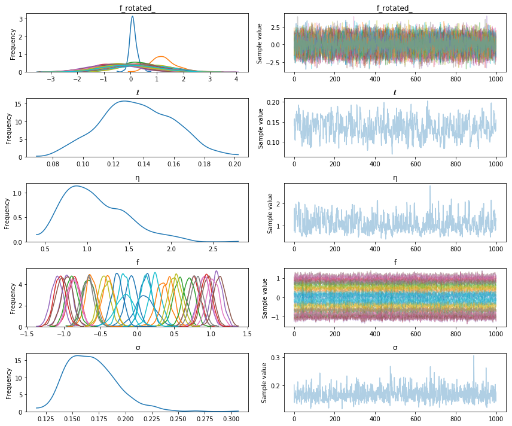
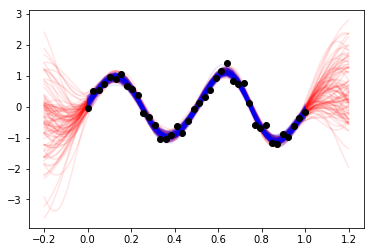

Title: GP module refactor
Date: 7/26/2017
Category: posts
Tags: gp, gsoc 
An outline of my refactor of the GP module so far.  

<!-- PELICAN_END_SUMMARY -->


## Sketch of the previous design

The previous design worked pretty well -- until it came time to think about adding in more advanced features and ways to speed up GPs.  Things like:

- Sampling from components of additive GPs.
- GPs on a grid using Kronecker structure.
- Covariance functions that have compact support.  Need sparse `Solve` and `Cholesky` ops.
- GP approximations that can be trained with stochastic gradient descent.
- GP approximations which work with latent variable models.
- Stacking GPs on other GPs, or warping the inputs of a GP with a neural net.

Thinking about how to do each of these started becoming complicated.  Any of these might take up the rest of the GSOC time, and I'm hoping to have some time after GP's to chip in on other parts of PyMC3.  

I think support for additive GPs is the most important item on that list.  Many introductions motivate GPs by describing how complex data
can be broken down into components using using sums of GPs, each with specialized and thoughtfully designed covariance functions.

## Problems (in particular, additive gps)

I wanted to make sure this was easy to do using PyMC3's GP library.  I was working on reproducing the `Keeling curve` analysis from the Rasmussen+Williams book, and also the `birthday` analysis in BDA3.  Doing so, I found that what I had so far was clumsy for modeling additive GPs.  Adding covariance functions works great,
    
    cov = cov1 + cov2 + cov3 + ...

But there is no reliable way to define

    gp = gp1 + gp2 + gp3 + ...
    
Overriding `__add__` wouldn't be so bad, but problems arise later it would be nice
to look at samples from `gp1`, `gp2` or `gp3`.  Doing this (cleanly!) was difficult.  It would've required repeating many of the argument values when defining `gp1`, `gp2`:

    gp1 = pm.gp.GP(name="gp1", X, cov1, mean1, sigma, "FITC", ...)
    gp2 = pm.gp.GP(name="gp2", X, cov2, mean2, sigma, "FITC", ...)
    ...
    
But each of the three `gp`'s don't have additive noise (parametrized by `sigma`) -- in this case the sum of them, after integrating out the latent gp function, is what does.  So this syntax would be misleading.  And what if a different `X` is given accidentally?  What if one used the "FITC" approximation, and the other used "VFE", how could they add?  This setup would be error prone for the user.  It would also be error prone for me to `raise` exceptions in all these cases.  

Below is an outline of the GP module before I reworked it.

## Sketch of old design


```python
def GP( ... ):
    """ 
    This function is called by the user.  It is responsible 
    for parsing the combination of argument values passed by 
    the user, and then for returning the correct GP implementation.
    """
    # ...
    # lots of parsing, checking, and setting things up here
    # ...
    return GPmodel
    

class _GP(object):
    """
    Base class for GP classes.  Only serves to provide a `random` method.
    """
    
    def random(...):
        """ Calls either `prior` or `conditional` of whatever GP object it
        is attached to.  Uses the mean and covariance returned to draw
        samples from MvNormal.
        """
        # ...
        return samples


class GPFullNonConjugate(_GP):
    """
    GP model where the latent GP itself (usually denoted "f") is
    modeled explicitly.  This model must be used whenever the likelihood
    is non-Gaussian.  The interesting part of this class it the `RV` method.
    """
    
    def __init__(self, ...):
        """
        Set the state of self given things like the inputs X, the
        covariance function, and the mean function
        """
    
    def prior(...):
        # ...
        return mean, covariance
    
    def conditional(X_new):
        # ...
        return mean, covariance
    
    @property
    def RV(self):
        """
        This gets called right after the GP class is first made.  Since this
        class doesn't inherit from a `Distribution`, it doesn't return a theano
        symbolic variable.  The reason I didn't have it inheret from `Distribution`
        is so that reparametrize it as a vector of standard Normals that is rotated
        by the Cholesky factor.  
        """
        v = Normal(name + "_rotated_", mu=0.0, sd=1.0)
        f = Deterministic(name, tt.dot(chol, v))
        return f
    
    def logp(...):
        In case this is called for some reason, it should return zero.  The random
        variable whose `logp` should be evaluated is `v`.
        return 0.0
     


class GPFullConjugate(_GP, Continuous):
    """
    This is the most straightforward implementation.
    """
    def __init__(...):
        basically the same __init__ as GPFullNonConjugate, except for a call to
        super
       
    def prior(...):
        # ...
        return mean, covariance
        
    def conditional(...):
        # ...
        return mean, covariance
        
    def logp(self, value):
        # ...
        return MvNormal.dist(mean, covariance).logp(value)
    

class GPSparseConjugate(_GP, Continuous):
     """ Set up just like `GPFullConjugate` 
     """  


def sample_gp(trace, gp_object, ...):
    """
    A specialized function for sampling from `gp_object`.
    """
```


      File "<ipython-input-1-85ad58b5b1b3>", line 1
        def GP( ... ):
                  ^
    SyntaxError: invalid syntax


## Post refactor

I ended up changing the syntax a lot.  In order to make the syntax more "math-like", I used `__call__` in an unusual way.  Hopefully there aren't issues with this that I haven't thought of.  

The GP model or implementation used is determined by its class name.  There is no factory function like `def GP(...)`.  When instantiated, the the `gp` is *only* assigned a covariance function.  There are no arguments for the type of approximation used, the mean function, or anything else.  The `gp` objects and how they add together is specified *before* complete information about the GP is specified.  This guarantees that they will, evantually, get consistent arguments from the user.  At this point, zero mean `gp`s with the same implementation and a given covariance function are being added.

Here is how this looks (just for illustration, this code isn't runnable):

    X = ... # input locations for the GP
    y = ... # observed data with IID Gaussian noise
    
    with pm.Model() as model:
        # define priors for ℓ1 and ℓ2
        ...
        
        # specify that y is the sum of two GP's with IID Gaussian noise
        cov1 = pm.gp.ExpQuad(1, ℓ1)
        gp1 = pm.GPMarginal(cov_func=cov1)
    
        cov2 = pm.gp.Matern52(1, ℓ2)
        gp2 = pm.GPMarginal(cov_func=cov2)
    
        gp = gp1 + gp2

Parameters like the lengthscales $\ell$ belong to the covariance functions, not the `gp` objects.

Notice that none of these objects have been given a name.  All PyMC3 random variables, and `Deterministic`s must be assigned a name.  None of the objects that have been defined are a PyMC3 random variable yet.  To construct the actual random variable, first for the marginal likelihood, `__call__` and `conditioned_on` have to be called.

    with model:
        # define marginal likelihood
        y_ = gp(name="y", size=len(y), mean_func=mean_func).conditioned_on(X, y=y)
 
What happened was:

- The __call__ method for `GPMarginal` has three non-parameter and non-random variable arguments describing the `GP` object:
  
  1. `name`, the name to assign to the (in this case, observed) random variable.
  2. `size`, the number of points (input or output) of the GP.  This is kind of a hack to get around some of PyMC3's issues with symbolic shapes.  This argument should be removed if that gets addressed.  I'd expect that most of the time the user will know the dimensions of the GP beforehand or will be able to access them from the data.
  3. `mean_func`.  The mean function is provided here.  Having the `mean_func` be part of the state will make it easy to sample from the `gp` with or without including effects from the mean function.

A reference to the object is returned, `return self`.  

- Then `conditioned_on(...)` is called.  It's arguments are strictly either variables or data, such as the inputs, the observed data, inducing points, or the noise standard deviation.  It returns a PyMC3 random variable that can be the GP's likelihood or its predictive distribution, depending on what the `gp` is conditioned on.

The main reason for the separation between state being set in `__call__` and random variables being set in `conditioned_on` is to have a nice syntax.  Another reason is so new distributions with different random variables can be remade, without necessarily messing with the object's state.  For instance, one may wish to remove the noise variance parameter, or to use different `Xs` input locations to predict at.  

The same `gp` object is used to construct the predictive distribution, which is used to draw samples from both `gp`, and `gp1` or `gp2`.  `conditioned_on` is called again to construct a new PyMC3 random variable for the GP's predictive distribution.

$$
p(f_* \mid y, X, X_*) \,.
$$

The observed data $y$ at locations $X$ and the new inputs $X_*$ are all given.  
    
    # inference
    with model:
        trace = pm.sample(1234)
        
    # define predictive distributions
    Xs = np.linspace(0,1,200)[:,None]
    with model:
        # Recover the latent function values from gp1.  Notice that Xs=X.  
        #   It's not required to do this, just possible.
        f1 = gp1("f1", size=200, mean_func=pm.Zero()).conditioned_on(X, y=y, Xs=X)
        
        # The predictive distribution of gp
        f_pred = gp1("f_pred", size=200, mean=mean_func).conditioned_on(X, y=y, Xs=Xs)
        
Since `conditioned_on` returns PyMC3 random variables, `sample_ppc` can be used!  There is no longer a need to define a specialized interface to sample from a `gp` object.

    # draw samples
    with model:
        samples = pm.sample_ppc(trace, vars=[f1, f_pred], samples=100)

For nearly all the current GP implementations, `f` or `f_pred` are plain instances of `MvNormal` with particular mean and covariance matrices.

## Sketch of new design

I think the new design might even be simpler than the old.  Here is a sketch of how things are now


```python
class GPBase(object):
    """
    All subclasses of GPBase must implement `_prior_rv`, and `_predictive_rv`.
    These two methods must return a PyMC3 random variable.  Subclasses of
    GPBase should not overwrite `conditioned_on`.
    """ 
    def __init__(self, cov_func):
        self.cov_func = cov_func
    
    def __add__(self, other):
        # error if they are not the same type
        return type(self)(self.cov_func + other.cov_func)
    
    def __call__(self, name, size, mean_func):
        # set state
        self.name = name
        #...
        return self
    
    def conditioned_on(self, X, Xs=None, **kwargs):
        if Xs is None:
            return self._prior_rv(X, **kwargs)
        else:
            return self._predictive_rv(X, **kwargs)
        

    def _prior_rv(self, X, **kwargs):
        raise NotImplementedError
    
    def _predictive_rv(self, X, **kwargs):
        raise NotImplementedError
        
        
class GPMarginal(GPBase):
    """
    This is an example of a GP subclass a user would actually use.
    As required, _prior_rv and _predictive_rv return random variables.
    """
    
    def _build_prior(self, X, sigma):
        # math goes here
        mu = self.mean_func(X)
        K = self.cov_func(X)
        # ...
        # returns the mean and the cholesky factor of covariance matrix \
        #   of the gp likelihood
        return mu, chol  
    
    def _build_predictive(self, X, y, Xs, sigma):
        # math goes here
        return mu, chol
    
    def _prior_rv(self, X, y, sigma):
        mu, chol = self._build_prior(X, sigma)
        # note that `observed` is set here using y, that we conditioned on
        return MvNormal(self.name, mu=mu, chol=chol, shape=self.size, observed=y)
        
    def _predictive_rv(self, X, y, Xs, sigma):
        mu, chol = self._build_predictive(X, y, Xs, sigma)
        return MvNormal(self.name, mu=mu, chol=chol, shape=self.size)

```

The Theano code for constructing the mean and covariance of these random variables is confined to `_build_prior`, and `_build_predictive`.  This keeps the implementation readable and cleanly separated from both the required random variable constructors, `_prior_rv` and `_predictive_rv`, or the programming logic, which can just be placed into other methods specific to the particular GP implementation.  

I think this setup should make for a pretty efficient pattern to help implement other GP models or approximations.  While I was at it, I implemented a class for a Student's T process in about 20 lines of code!

## Example

Here is an actual runnable example.  This implementation is of a full GP where the latent `f` hasn't been integrated out.  **This code isn't part of master yet, so to run you would need to check out the branch "gp-module"**.


```python
import pymc3 as pm
import theano.tensor as tt
%matplotlib inline

# data
X = np.linspace(0,1,40)[:, None]
y = np.sin(2*np.pi*X.flatten()*2) + 0.2*np.random.randn(40)

with pm.Model() as model:
    ℓ = pm.Gamma("ℓ", alpha=1, beta=1)
    η = pm.HalfCauchy("η", beta=3)
    cov = tt.square(η) * pm.gp.cov.ExpQuad(1, ℓ) 
    mean = pm.gp.mean.Zero()
    
    # GPLatent samples the latent function values of the GP directly
    gp = pm.gp.GPLatent(cov_func=cov)
    f = gp("f", 40, mean).conditioned_on(X)
    
    σ = pm.HalfCauchy("σ", beta=3)
    y_ = pm.Normal("y_", mu=f, sd=σ, observed=y)
    tr = pm.sample(1000)
```

    Auto-assigning NUTS sampler...
    Initializing NUTS using advi+adapt_diag...
    Average Loss = 53.373:   7%|▋         | 13484/200000 [00:24<06:24, 485.59it/s]
    Convergence archived at 13500
    Interrupted at 13,500 [6%]: Average Loss = 74.843
    100%|██████████| 1500/1500 [04:57<00:00,  6.72it/s]/home/bill/pymc3/pymc3/step_methods/hmc/nuts.py:463: UserWarning: Chain 0 contains 25 diverging samples after tuning. If increasing `target_accept` does not help try to reparameterize.
      % (self._chain_id, n_diverging))
    


```python
pm.traceplot(tr);
```





```python
# points to predict at
Xs = np.linspace(-0.2, 1.2, 100)[:,None]

# make predictive distribution
with model:
    f_pred = gp("f_pred", 100, mean).conditioned_on(X, Xs=Xs, f=f)

# sample from f_pred with sample_ppc
with model:
    samples = pm.sample_ppc(tr, vars=[f_pred], samples=100)

plt.plot(Xs.flatten(), samples[f_pred.name].T, "r", alpha=0.1);
plt.plot(X.flatten(), (tr["f"][-100:]).T, "b", alpha=0.1);
plt.plot(X.flatten(), y, 'ko');
```

    100%|██████████| 100/100 [00:00<00:00, 113.06it/s]




