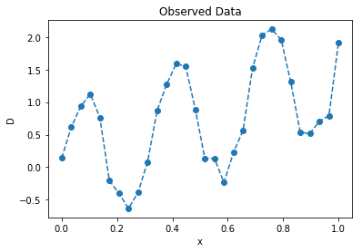
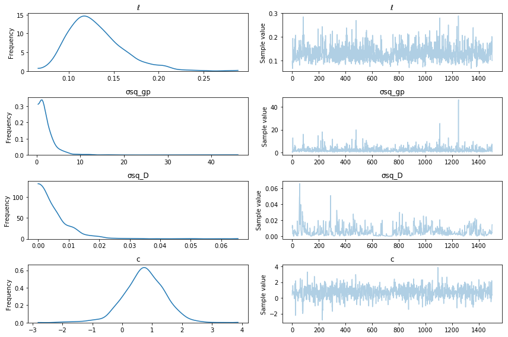
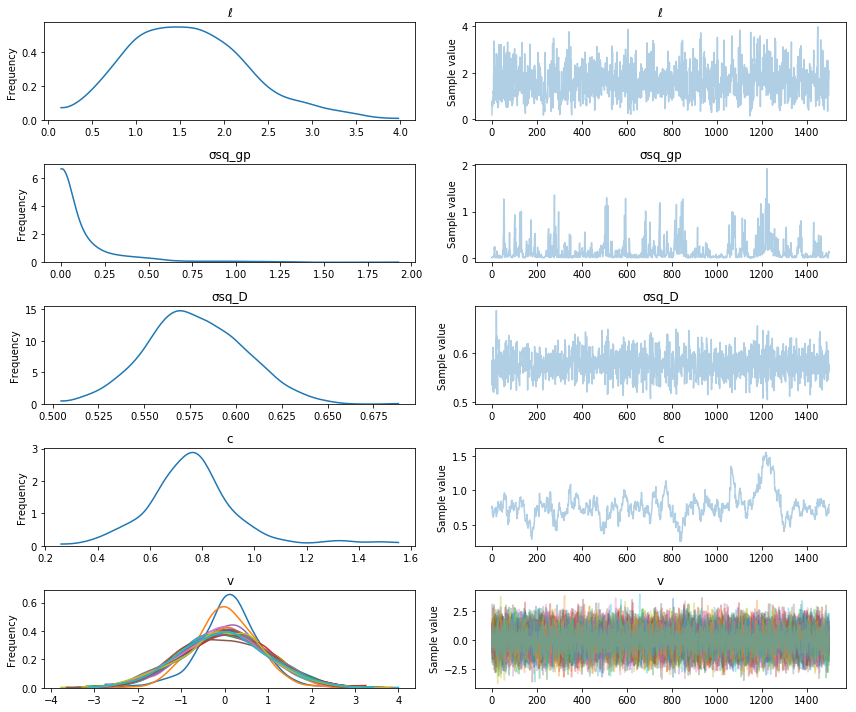

Title: Gaussian processes models
Date: 5/25/2017
Category: posts
Tags: gp, gsoc
A from-the-ground-up description of Bayesian gaussian process models.  

<!-- PELICAN_END_SUMMARY -->


Before looking for places to pick up computational speedups, it's important to look closely at the math.  Most descriptions of gaussian processes (at least that I've found) focus on the conjugate case, but here I want to focus more on the general case.

# Gaussian Processes 

In the general case, the GP model can be written as

$$
\begin{align}
\phi \sim \mathrm{Prior}& \\
\theta \sim \mathrm{Prior}& \\
f \sim \mathcal{GP}(\mu(\phi;\,x),\, K(\theta;\, x, x')) & \\
D \sim \mathrm{Likelihood}(f \mid \phi, \theta, x)
\end{align}
$$

The first two lines are the priors on the hyperparameters of the mean and covariance functions.  The next line is the prior on $f$, which is a gaussian process.  The last line is the likelihood of the observed data $D$ given the GP.  The key for the variables is:

- $f$: Realization of the GP
- $x$: Inputs, locations where the GP $f$ is realized
- $K(\theta; \, x, x')$: The covariance function of the gaussian process prior
- $\mu(\phi ; \, x)$: The mean function of the gaussian process prior
- $\theta$: Covariance function hyperparameters 
- $\phi$: Mean function hyperparameters 
- $\mathcal{GP}$ The gaussian process prior, it represents a multivariate normal distribution with a mean and covariance

There are two tasks that will need to be accomplished when using GP models,

1. Infer the posterior distributions of $\theta$, $\phi$ and $f$. 
2. Obtain the predictive distribution for the GP at new locations, denoted $x_*$.

---

## Inferring the posterior distribution of the hyperparameters

After specifying the priors and fully defining the model, the first computational step is to infer the posterior distributions of the unknown hyperparameters, $\phi$ and $\theta$, and the GP $f$.  The joint posterior distribution of the hyperparameters $\theta, \phi$ and the gaussian process $f$ is

$$
p(\phi\,, \theta\,, f \mid D) \propto p(D \mid \phi \,, \theta \,, f) p(f \mid \phi \,, \theta) p(\theta \,, \phi) \,.
$$  

The GP is represented by the term $p(f \mid \phi \,, \theta)$, and is a multivariate normal,

$$
p(f \mid \phi \,, \theta) = \frac{1}{\sqrt{ | 2\pi K |} } \exp{( -\frac{1}{2} (\mu - f)^T K^{-1} (\mu - f) )} \,.
$$

To keep the notation simple, we neglect to denote the fact that the $\mu$ and $f$ vectors are functions of the hyperparameters $\phi$, $\theta$ and of the input locations $x$.  

It's often the case in practice that the mean function is the zero vector, $\mu = 0$ (so there are no $\phi$ hyperparameters).  Often the data can be rescaled to have a mean of zero before building a GP model.  Often, a simple mean function, such as constant or linear does improves the model.  However, in more physical situations, the mean function may be something from theory.  Throughout the rest of this post, we include a mean function for generality.

In order to evaluate the GP prior, we need to compute the determinant of $K$ and invert $K$.  The standard way of doing this is via the Cholesky decomposition.  The Cholesky decomposition is a way to compute a "matrix square root", $K = LL^T$.  The triangular $L$ can be used to both compute the determinant, and compute $(\mu - f) K^{-1}$ indirectly via a solve.  Below is a code snippet evaluating the log-likelihood, including a timing comparison with SciPy's built in multivariate normal `logpdf` method, which uses the slower SVD decomposition under the hood to control small eigenvalues in the covariance matrix.


```python
import numpy as np
import scipy as sp
import scipy.linalg

def mvn_logpdf(f, mu, K):
    diff = f - mu
    L = sp.linalg.cholesky(K, lower=True)
    tmp = sp.linalg.solve_triangular(L, diff, lower=True)
    logdet = 2.0 * np.sum(np.log(np.diag(L)))    
    loglike = -0.5 * (np.dot(tmp.T, tmp) + logdet + f.size*np.log(2*np.pi))
    return loglike
```


```python
import scipy.stats

n = 300
mu = np.random.randn(n)
A = np.random.randn(n,n)
K = np.dot(A.T, A) + 1e-8 * np.eye(n) # make K positive definite
f = np.random.randn(n)

print("Using cholesky implementation")
%timeit mvn_logpdf(f, mu, K)

print("\nUsing scipy implementation (which uses the SVD)")
%timeit sp.stats.multivariate_normal.logpdf(f, mean=mu, cov=K)
```

    Using cholesky implementation
    The slowest run took 13.88 times longer than the fastest. This could mean that an intermediate result is being cached.
    1000 loops, best of 3: 1.56 ms per loop
    
    Using scipy implementation (which uses the SVD)
    100 loops, best of 3: 18.3 ms per loop


Notice the Cholesky implementation is about 20x faster (on my laptop).  However, the SciPy version will be more accurate and won't throw an error when the decomposition is numerically unstable and some eigenvalues in $K$ are close to zero.  

---

## Conjugacy

An important special case for GPs is when the noise on the observed data $D$ is normally distributed.  The model in this case is,

$$
\begin{align}
\phi \sim \mathrm{Prior}& \\
\theta \sim \mathrm{Prior}& \\
f \sim \mathcal{GP}(\mu(\phi;\,x),\, K(\theta;\, x, x')) & \\
D_i \sim N(f_i, \sigma^2)
\end{align}
$$

Note that there is no need for the noise to be white, or IID.  If the observed noise isn't white, we can modify the last line of the model to be $D \sim N(f, K_{noise})$, where $K_{noise}$ is the covariance of the noise (which may also be from a covariance function with unknown hyperparameters) which would be multivariate normally distributed. 

Exploiting conjugacy in GPs can be viewed as a way of speeding up computation when the observed data follows a normal distribution.  The GP prior is conjugate to the likelihood, since they are both normal.  In the conjugate case, the GP $f$ can be integrated out, yielding the *marginal* likelihood,

$$
\begin{align}
\int p(\phi\,, \theta\,, f \mid D) df &\propto \int p(D \mid \phi \,, \theta \,, f) p(f \mid \phi \,, \theta) p(\theta \,, \phi) df \\
p(\phi\,, \theta \mid D)  &\propto \int p(D \mid \phi \,, \theta \,, f) p(f \mid \phi \,, \theta) df \, p(\theta \,, \phi) \\
\end{align}
$$

Using conjugacy, the remaining integral on the right hand side can be done analytically.  The solution is

$$
\int p(D \mid \phi \,, \theta \,, f) p(f \mid \phi \,, \theta) df = p(D \mid \phi \,, \theta) = N(0, K + \sigma^2 I) \,.
$$

Since this is a multivariate normal distribution, we can use the same Cholesky based routine that was used above to compute the marginal likelihood, replacing $K$ with $K + \sigma^2 I$ (or $K + K_{noise}$).  The big takeaway here is that we can get the posterior distribution of $\phi$ and $\theta$, without having to get the $n$ dimensional posterior distribution of $f$.  This is much easier and faster to do.  Also, we can use the same computational routine needed to evaluate the probability of the GP prior, to compute the infer the posterior distributions of $\theta$ and $\phi$.

### PyMC3 Example:


```python
# add pymc3 master to path
import sys
sys.path.insert(0, "~/pymc3/")

import pymc3 as pm
import theano.tensor as tt
import matplotlib.pyplot as plt
%matplotlib inline

# generate some data
n = 30
π = np.pi
x = np.linspace(0, 1, n)
D = 1.5 * x + np.sin(2 * π * 3 * x) + 0.15 * np.random.randn(n)

plt.plot(x, D, '--o');
plt.title("Observed Data"); plt.ylabel("D"); plt.xlabel("x");
x = x[:,None]
```





```python
# define positive normal distribution with a lower bound
BoundedNormal = pm.Bound(pm.Normal, lower=0)

# define gp model in pymc3
with pm.Model() as conjugate_gp:
    σsq_gp = pm.HalfCauchy("σsq_gp", beta=2)  # scales the covariance function
    ℓ = BoundedNormal("ℓ", mu=0.5, sd=1)      # lengthscale of the covariance function (weakly informative)
    
    k = σsq_gp * pm.gp.cov.Matern52(1, ℓ) # the covariance function
    K = k(x, x) # evaluate the covariance function at the inputs
    
    c = pm.Normal("c", mu=0, sd=2)            # prior for mean function y-intercept
    μ = c * tt.ones(n)                        # constant mean function
    
    # likelihood of the observed data
    σsq_D = pm.HalfCauchy("σsq_D", beta=2)
    D_obs = pm.MvNormal('D_obs', mu=μ, cov=K + σsq_D * tt.eye(n), observed=D)

# draw samples
with conjugate_gp:
    trace = pm.sample(2000)
    
pm.traceplot(trace[500:], varnames=["ℓ", "σsq_gp", "σsq_D", "c"]);
```

    Auto-assigning NUTS sampler...
    Initializing NUTS using ADVI...
    Average Loss = 39.983: 100%|██████████| 200000/200000 [06:07<00:00, 544.52it/s]
    Finished [100%]: Average Loss = 39.987
    100%|█████████▉| 1999/2000 [02:25<00:00, 17.62it/s]/home/bill/pymc3/pymc3/step_methods/hmc/nuts.py:237: UserWarning: Step size tuning was enabled throughout the whole trace. You might want to specify the number of tuning steps.
      warnings.warn('Step size tuning was enabled throughout the whole '
    /home/bill/anaconda3/lib/python3.5/site-packages/numpy/core/_methods.py:59: RuntimeWarning: Mean of empty slice.
      warnings.warn("Mean of empty slice.", RuntimeWarning)
    100%|██████████| 2000/2000 [02:25<00:00, 13.70it/s]





---

## Non-Conjugacy

In the non-conjugate case, the integral

$$
\int p(\phi\,, \theta\,, f \mid D) \, df \propto \int p(D \mid \phi \,, \theta \,, f) p(f \mid \phi \,, \theta) p(\theta \,, \phi) \, df 
$$

has no analytic solution.  MCMC or variational inference methods need to be used to estimate the posterior $p(f \,, \phi \,, \theta \mid D)$ directly.  This is very challenging! The GP $f$ is $n$ dimensional (where $n$ is the number of data points) and highly correlated, which are basically the two things that make sampling difficult.  And there is no guarantee it won't be multimodal, why not throw that in too.

The GP library [GPflow](https://github.com/GPflow/GPflow) uses a really nice reparameterization of the model that takes care of the 'highly correlated' issue.  This reparameterization is enabled by the ability to automatically propagate gradients through the Cholesky decomposition.  See [here](http://gpflow.readthedocs.io/en/latest/notebooks/mcmc.html) for a full description.

The model is reparameterized as

$$
\begin{align}
\phi \sim \mathrm{Prior}& \\
\theta \sim \mathrm{Prior}& \\
LL^T = \mathrm{cholesky}(K(\theta;\, x, x'))& \\
v \sim N(0, 1) & \\
f = \mu(\phi;\,x) + Lv &  \\
D \sim \mathrm{Likelihood}(f \mid \phi \,, \theta \,, x)& \\
\end{align}
$$

- the cholesky is used in both the non-conjugate case and the conjugate case.  Here its explicit because its used in the reparameterization of the model.  this reparameterization is for the non-conjugate case. for the conjugate case you still need the cholesky to evaluate the multivariate normal log likelihood.

where the new random variable is not $f$ anymore, but $v$.  The posterior distribution of $v$ will be **much** less correlated than the posterior distribution of $f$.

### PyMC3 Example:

In this model the observed data is still normal, but we don't exploit conjugacy to infer the posterior of $\theta$, $\phi$, and (in this case) $v$.


```python
# define gp model in pymc3
with pm.Model() as non_conjugate_gp:
    σsq_gp = pm.HalfCauchy("σsq_gp", beta=2)  # scales the covariance function
    ℓ = BoundedNormal("ℓ", mu=0.5, sd=1)      # lengthscale of the covariance function (weakly informative)
    
    k = σsq_gp * pm.gp.cov.Matern52(1, ℓ) # the covariance function
    K = k(x, x) # evaluate the covariance function at the inputs
    
    c = pm.Normal("c", mu=0, sd=2)            # prior for mean function y-intercept
    μ = c * tt.ones(n)                        # constant mean function
    
    # Use GPflow's reparameterization
    L = tt.slinalg.cholesky(K + 1e-8 * tt.eye(n))  # ensure numerical stability
    v = pm.Normal("v", mu=0.0, sd=1.0, shape=(n,1)) 
    gp = pm.Deterministic("gp", tt.dot(L, v))
    
    # likelihood of the observed data
    σsq_D = pm.HalfCauchy("σsq_D", beta=2)    # variance of the gaussian noise
    D_obs = pm.Normal('D_obs', mu=gp + μ, sd=tt.sqrt(σsq_D + 1e-8), observed=D)

# draw samples
with non_conjugate_gp:
    trace = pm.sample(2000) 
```

    Auto-assigning NUTS sampler...
    Initializing NUTS using ADVI...
    Average Loss = 1,043: 100%|██████████| 200000/200000 [04:15<00:00, 781.65it/s]  
    Finished [100%]: Average Loss = 1,043
    100%|█████████▉| 1997/2000 [02:18<00:00, 14.99it/s]/home/bill/pymc3/pymc3/step_methods/hmc/nuts.py:237: UserWarning: Step size tuning was enabled throughout the whole trace. You might want to specify the number of tuning steps.
      warnings.warn('Step size tuning was enabled throughout the whole '
    /home/bill/anaconda3/lib/python3.5/site-packages/numpy/core/_methods.py:59: RuntimeWarning: Mean of empty slice.
      warnings.warn("Mean of empty slice.", RuntimeWarning)
    100%|██████████| 2000/2000 [02:18<00:00, 14.45it/s]


```python
pm.traceplot(trace[500:], varnames=["ℓ", "σsq_gp", "σsq_D", "c", "v"]);
```





---

## Prediction

Similar calculations are involved in prediction.  The determinant isn't required anymore, but we still need to invert $K(x, x')$.  As is pretty standard, the predictions of the GP at the inputs $x_*$ are denoted $f_*$.  
The predictive distribution is $p(f_* \mid f\,, \phi \,, \theta)$.  

If values of $\theta$ and $\phi$, the covariance and mean function hyperparameters, are given, then $K$ and $\mu$ is given (for arbitrary input points $x$).  The value of $f$ at the original inputs $x$ also needs to be given.  Conditional on these values, the predictive distribution of $f_*$ is gaussian.  The predicted value $f_*$ of the GP conditioned on a value of $\theta$ and a value of $f$ is

$$
p(f_* \mid \phi\,, \theta\,, f) \sim N(\mu + K(x_*, x) K(x,x)^{-1} f, K(x_*, x_*) - K(x_*, x) K(x,x)^{-1} K(x, x_*))
$$

If the points we wish to predict at are the same ones as the given inputs $x$, then
$f_* = f$ and $x_* = x$.  Then the above equation reduces to  

$$
\begin{align}
f_* \mid x_*, x, f &\sim N(\mu + K(x_*, x) K(x,x)^{-1} f, K(x_*, x_*) - K(x_*, x) K(x,x)^{-1} K(x, x_*)) \\
f \mid x, f &\sim N(\mu + K(x, x) K(x, x)^{-1} f, K(x, x) - K(x, x) K(x, x)^{-1} K(x, x)) \\
f &\sim N(\mu + f, 0)
\end{align}
$$

which is just the given value of $f$ (notice that the covariance is zero).  This is just for the GP though, instances of which may not be the observed data.  The observed data could follow any distribution, and the likelihood function of the data could be anything.  If we were predicting new data points $D_*$, we would need to condition the likelihood function of the observed data on $f_*$.

The case where the GP $f$, or a noisy version of it, **is** observed can exploit conjugacy.  The conditional distribution is similar, but the noise is incorporated,

$$
p(f_* \mid \phi \,, \theta \,, f) \sim N(\mu + K(x_*, x) [K(x,x) + \sigma^2 I]^{-1} f \,, K(x_*, x_*) - K(x_*, x) [K(x,x) + \sigma^2 I]^{-1} K(x, x_*))
$$

### Computations in PyMC3

It is straightforward currently to do inference on GP the hyperparameters within PyMC3.  The tricky part is doing prediction.  The goal of some of my GSoC work this summer will be to make this just as straightfoward. 
The main bottleneck in gaussian process computation is the inversion and determinant of $K$.  A good way of computing these two quantities in general is with the Cholesky decomposition.  It's computational complexity is $\mathcal{O}(n^3)$, where $n$ is the number of rows or columns of the matrix being decomposed (and so the number of data points).  

## Next time ...

For PyMC3, Theano, which PyMC3 uses as a computation engine, also needs to be able to compute the gradient.  In the next post, I'll itemize some matrix structure exploiting options for speeding up GPs in PyMC3.

---
