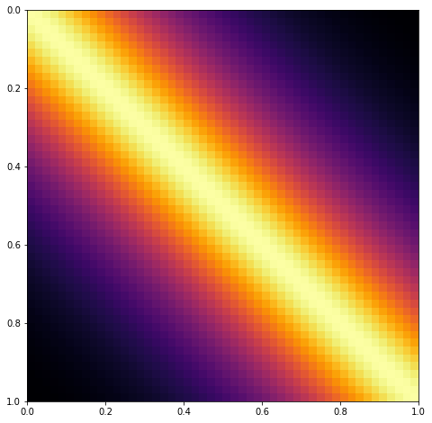
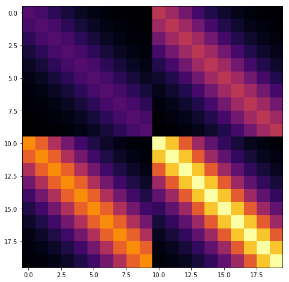
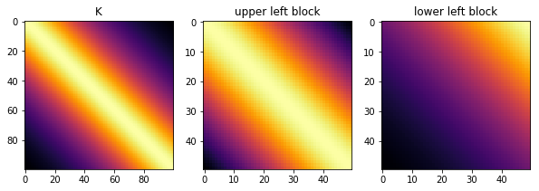

Title: Speeding up GPs with special kernel matrix structure
Date: 5/29/2017
Category: posts
Tags: gp, gsoc, gp-approximations
Linear algebra tricks to speed up GPs

<!-- PELICAN_END_SUMMARY -->


The goal of PyMC3 is to be able to flexibly define Bayesian models.  So, we don't want to restrict users to the case where the GP prior is conjugate to the likelihood.  It should be easy to use non-conjugate likelihoods.  I think any tricks we might employ should be visible to the user and optional with a smart way of choosing defaults.  Each could be turned on by setting a flag.  

# Speeding up Computation

The computational complexity of the Cholesky decomposition is $\mathcal{O}(n^3)$, where $n$ is the number of rows or columns of the matrix being decomposed (and so the number of data points).  For PyMC3, Theano also needs to be able to compute the gradient.   

The three main ways that I've been able to find in the literature of reducing the $\mathcal{O}(n^3)$ complexity from the Cholesky decomposition can be summarized very roughly as:

1. Exploit special structure in the matrix $K$ with specialized linear algebra algorithms
2. Make $K$ effectively smaller ("inducing point methods")
3. Variational methods (not discussed here, I'm still reading!)

This post is about 1.

---
 
##  Exploiting Matrix Structure

The first set of methods exploits structure in the covariance matrix (or kernel) to speed up the solve operation.  Depending on the problem, these methods can be combined.


```python
import pymc3 as pm
import theano
import matplotlib.pyplot as plt
%matplotlib inline
```

### Toeplitz structure

Each diagonal of a Toeplitz matrix is constant.  For instance, the following matrix is Toeplitz:

$$
A = \begin{bmatrix}
a & b & c & d & e \\
f & a & b & c & d \\
g & f & a & b & c \\
h & g & f & a & b \\
i & h & g & f & a 
\end{bmatrix}
$$

If a stationary covariance matrix is used, such as the Matern and Exponentiated Quadratic, and the inputs `X` are evenly spaced and one dimensional, then the resulting covariance matrix has Toeplitz structure.  An example of a covariance matrix with Toeplitz structure is shown below.


```python
X = np.linspace(0,1,50)[:,None]
# define and evaluate covariance function
K = theano.function([], pm.gp.cov.Matern32(1, 0.3)(X))()

ax = plt.figure(figsize=(8,8)).add_subplot(111)
m = ax.imshow(K, cmap="inferno",
              interpolation='none',
              extent=(np.min(X), np.max(X), np.max(X), np.min(X)));
```





To include this in PyMC3 would require a new Op and gradient to be implemented (eventually, preferably) in Theano. This may also benefit some time series methods. 

##### References

- [KISS-GP](https://arxiv.org/abs/1503.01057)
- [Cunningham et al.](http://icml2008.cs.helsinki.fi/papers/151.pdf)
- [Fast Cholesky Factorization](http://www.math.niu.edu/~ammar/cortona/node3.html)

### Kronecker Structure

It may be possible to exploit Kronecker structure if the number of $X$ dimensions is greater than 1.

The product of two covariance functions is also a covariance function, even if the inputs are over different spaces.  For example, in the two dimensional case, $k = k_1(x_1, x_1') k_2(x_2 , x_2')$ is a valid covariance function.  If the number of $x_1$ data points is $n_1$, and the number of $x_2$ data points is $n_2$, then the dimension of the $k$ **matrix** will be $n_1 n_2 \times n_1 n_2$ (large!).

Fortunately, the matrix $K$ can be written in terms of a Kronecker product, $K = K_1 \otimes K_2$, and the inverse of a Kronecker product is equal to the Kronecker product of the inverses, $K^{-1} = K_1^{-1} \otimes K_2^{-1}$.  

For example, in a two dimensional scenario, this reduces complexity from $\mathcal{O}((n_1 n_2)^3)$ to the much faster $\mathcal{O}(n_1^3) + \mathcal{O}(n_2^3)$.

The full matrix $K$ has an apparent blocked structure, as shown below.


```python
x1 = np.linspace(0,1,10)[:,None]
K1 = theano.function([], pm.gp.cov.Matern32(1, 0.3)(x1))()

A = np.array([[1,2], [3,4]])
K = np.kron(A, K1)

ax = plt.figure(figsize=(8,8)).add_subplot(111)
m = ax.imshow(K, cmap="inferno",
              interpolation='none')
```





$K = K_1 \otimes K_2$ has no diagonal noise term.  If we add a diagonal noise term, $K' = K_1 \otimes K_2 + \sigma^2 I$, then the `eigh` routine can be used instead of the Cholesky to decompose individual matrices instead of the Cholesky, and the speedup is still obtained.

I think an implementation in PyMC3 would be best done within the `GP` class.  If the `cov_func` argument was given a list of covariance matrices and a list of inputs, the `GP` class would be able to sort it out.  For instance, something like

    gp = pm.gp.GP('gp', cov_func=[k1, k2, k3], inputs=[x1, x2, x3])

might work.

##### References

- [Saatchi Thesis](https://pdfs.semanticscholar.org/e08f/8db209278eabd13a6b9966e14d10c924b704.pdf)
- KISS-GP
- [Fast Hierarchical GPs](http://sethrf.com/files/fast-hierarchical-GPs.pdf)
- [Efficient Infernce in Matrix-variate ...](https://papers.nips.cc/paper/4281-efficient-inference-in-matrix-variate-gaussian-models-with-iid-observation-noise)

### The HODLR solver

Many common covariance functions produce hierarchical off-diagonal low-rank (HODLR) covariance matrices, pictured below.  The HODLR solver can be applied to speed up inversion and determinant computation to $\mathcal{O}(n log{}^2 n)$ time.  The algorithm can be applied in a black-box fashion, and works best on lower dimensional problems where $d < 3$.  Periodic covariances, for instance, are not HODLR.

A low rank matrix is one with small eigenvalues that can be approximated as
$$
K \approx Q_{n \times p} D_{p \times p} Q^T_{p \times n}
$$
with $p < n$.  

The HODLR solver uses fast low rank factorizations of off diagonal blocks, and usual full rank solvers for diagonal blocks.

Below shows that the `Matern32` covariance is HODLR.  The GP library George contains bindings to the HODLR solver.


```python
x = np.linspace(0,1,100)[:,None]
K = theano.function([], pm.gp.cov.Matern32(1, 0.4)(x))()
tol = 1e-6

fig = plt.figure(figsize=(10,5))
ax1 = fig.add_subplot(131)
ax2 = fig.add_subplot(132)
ax3 = fig.add_subplot(133)
ax1.imshow(K, cmap="inferno",
           interpolation='none')
ax2.imshow(K[:50,:50], cmap="inferno",
           interpolation='none')
ax3.imshow(K[50:,:50], cmap="inferno",
           interpolation='none')
ax1.set_title("K"); ax2.set_title("upper left block"); ax3.set_title("lower left block")

print("Rank of K:", np.linalg.matrix_rank(K, tol=tol))
print("Rank of upper left block:", np.linalg.matrix_rank(K[:50,:50], tol))
print("Rank of lower left block:", np.linalg.matrix_rank(K[50:,:50], tol))
```

    Rank of K: 100
    Rank of upper left block: 50
    Rank of lower left block: 2





To include in PyMC3, a HODLR solver Op would need to be added to either PyMC3 or Theano.  I'm not sure how the gradient implementation would work here, depending on the details I could see this potentially being a little tricky.

##### References

- [HODLR solver paper](https://arxiv.org/pdf/1403.6015.pdf)
- [HODLR solver code](https://github.com/sivaramambikasaran/HODLR)
- [George](http://dan.iel.fm/george/current/)

### Covariance functions with compact support

If the data being fit doesn't exhibit long-distance correlations, then many elements in the covariance matrix will be near zero.  If the matrix were actually sparse, then linear algebra routines could be applied for computational gains. Simply zeroing out these small values won't in general produce a matrix that is positive definite.  

Some kernels have compact support, and so will yield covariance matrices that are sparse when, for example, the domain of the data is large and the function being fit is high frequency or has a small lengthscale.  Including covariance function(s) with compact support should be pretty straightforward in PyMC3.

##### References:

- [Scattered Data Approximation, Wendland (ch 9)](https://www.amazon.com/Scattered-Approximation-Monographs-Computational-Mathematics/dp/0521843359)
- [book chapter](http://www.math.iit.edu/~fass/603_ch4.pdf)

---

##  Next ...

There are other approaches out there.  I plan on adding them as I come across them.  The next post is about point number two, inducing point methods.  
