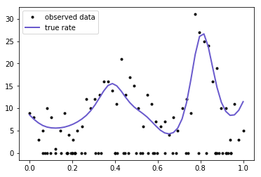
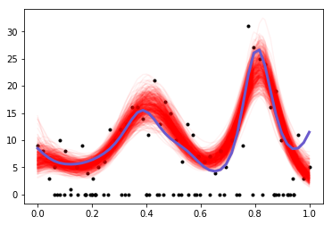

Title: GPs with non-Normal likelihoods in PyMC3
Date: 7/10/2017
Category: posts
Tags: gp, gsoc 
Gaussian processes can be used with non-Gaussian likelihoods.  In this case, the latent variables cannot be marginalized away.  

<!-- PELICAN_END_SUMMARY -->

The integral 

$$
\int p(D \mid f, \theta) p(f \mid \theta) df
$$

is intractable.  Inference is more difficult because the GP latent variable $f$ needs to be sampled directly.  The GP class of PyMC3 can now easily handle such models, with no special syntax.  

First we use a GP to generate some data that follows a zero-inflated Poisson model.
Then we see how well we can recover the true parameters.  This is a somewhat strange scenario that the GP libraries (that I know of) wouldn't be able to handle, at least without extensions or hackery.  Another option would be Stan, but the model would be more difficult to code.

** Since this is still under active development, to try this out you will need to checkout [this branch](https://github.com/pymc-devs/pymc3/pull/2322) on the PyMC3 repository**


```python
import pymc3 as pm
import theano
import theano.tensor as tt
import numpy as np
import matplotlib.pyplot as plt
%matplotlib inline
np.random.seed(140)
```

- 50% of the observed data are zero
- 50% follow a Poisson distribution whose rate is a function of location, $x$
- The rate is $\exp(f)$ and the latent function $f$ is a GP
- the GP has a mean of $c = 2$, and has a Exponential Quadratic covariance function with a lengthscale $\ell = 0.1$


```python
n = 100
true_p = 0.5  # 50% of the variates are poisson
n_p = int(100 * true_p)
x_p = np.linspace(0,1,n_p)
true_ℓ = 0.1 # true lengthscale 
true_c = 2.0 # true GP mean
K = pm.gp.cov.ExpQuad(1, true_ℓ)(x_p[:,None]).eval() + np.eye(n_p)*1e-6
true_f = np.random.multivariate_normal(true_c * np.ones(n_p), K, 1).flatten()
mu = np.exp(true_f)
y = np.random.poisson(mu)

# add in the zeros
xz = np.random.rand(n - n_p)
x = np.concatenate((x_p, xz))
y = np.concatenate((y, np.zeros(n-n_p)))
```


```python
# ignore
plt.plot(x, y, 'ko', ms=3, label="observed data");
plt.plot(x_p, mu, 'slateblue', lw=2, label="true rate");
plt.legend();
```





The domain of our data is from zero to one, so we place a weakly informative prior over the lengthscale `ℓ` and the constant parameter `c`.  They give less support to small values and values larger than one.  There is also a Beta(1,1) prior on the parameter `p`.


```python
with pm.Model() as model:
    ℓ = pm.Gamma("ℓ", alpha=2, beta=2)
    cov = pm.gp.cov.ExpQuad(1, ℓ)
    
    c = pm.Gamma("c", alpha=2, beta=1)
    mu = pm.gp.mean.Constant(c)
    
    f = pm.gp.GP("f", X=x[:,None], mean_func=mu, cov_func=cov)
    
    p = pm.Beta("p", alpha=1, beta=1)
    likelihood = pm.ZeroInflatedPoisson("likelihood", psi=p, theta=tt.exp(f), observed=y)
    
    tr = pm.sample(2000)
```

    Auto-assigning NUTS sampler...
    Initializing NUTS using ADVI...
    Average Loss = 270.56:  10%|▉         | 19975/200000 [01:03<09:22, 319.80it/s]
    Convergence archived at 20000
    Interrupted at 20,000 [10%]: Average Loss = 370.58
    100%|██████████| 2500/2500 [16:48<00:00,  2.92it/s]


```python
pm.traceplot(tr, lines={"ℓ": true_ℓ, "p": true_p, "c": true_c});
```


The inference on the parameters `p` and `c` look pretty accurate, though the posterior of `c` is not much different than its prior.  `ℓ` is a little biased, but the random sample we drew from the GP may have varied unusually rapidly.  Lets check samples of the latent variable, which is the Poisson rate, what we care most about.


```python
# sort for the plot
rate_samples = tr["f"].T
ix = np.argsort(x)
```


```python
plt.plot(x, y, 'ko', ms=3);
plt.plot(x[ix], np.exp(tr["f"][-500:,ix].T), 'r', alpha=0.05);
plt.plot(x_p, np.exp(true_f), 'slateblue', lw=3);
```





Looks pretty good!
